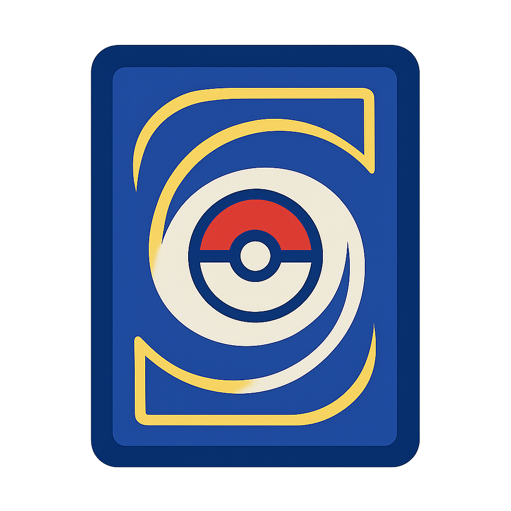

# Poké Booster Bot



Polski bot Discord do kolekcjonowania kart Pokémon i otwierania wirtualnych boosterów.
Korzysta z [Pokemon TCG API](https://pokemontcg.io/) i pozwala zbierać karty,
wykonywać codzienne zadania oraz handlować przedmiotami w wbudowanym sklepie.


## Funkcje

- **Kolekcja kart** – kupuj i otwieraj boostery z prawdziwych setów Pokémon.
- **System ekonomii** – zdobywaj monety przez codzienne nagrody i osiągnięcia,
  a następnie wydawaj je w sklepie.
- **Sklep** – przeglądaj dostępne boostery i przedmioty, dodawaj je do koszyka
  i finalizuj zakupy w jednym miejscu.
- **Osiągnięcia i ranking tygodniowy** – zdobywaj odznaki za master sety,
  30‑dniowy streak i najlepszy drop tygodnia.
 - **Giveaway** – administratorzy mogą tworzyć losowania boosterów.
   Zwycięzcy otrzymują nagrody automatycznie i dostają powiadomienie w DM.
- **Eventy** – czasowe bonusy jak podwójne monety lub zwiększona szansa na drop.

## Instalacja

1. Zainstaluj zależności:
   ```bash
   pip install -r requirements.txt
   ```
2. Utwórz plik `.env` i wpisz w nim wartości tokenu bota Discord oraz klucza
   API:
   ```ini
   BOT_TOKEN=twoj_token_bota
   POKETCG_API_KEY=twoj_klucz_api
   # Opcjonalnie ID emoji bc_coin na Twoim serwerze
   BC_COIN_ID=1381617796282319010
   # Opcjonalnie ID roli do powiadomień o eventach
   EVENT_ROLE_ID=123456789012345678
   ```
3. Uruchom bota:
   ```bash
   python3 bot.py
   ```

## Podstawowe komendy

- `/start` – załóż konto i odbierz startową pulę monet.
- `/saldo` – sprawdź aktualną ilość posiadanych monet.
- `/daily` – codzienna nagroda pieniędzy (24 h cooldown). Co 7 dni serii otrzymasz bonus 200 BC.
- `/sklep` – otwiera widok sklepu z boosterami i przedmiotami.
- `/profil` – wyświetla Twój profil z kartami i boosterami.
- `/profil_gracza` – pokaż uproszczony profil wskazanego gracza.
- `/osiagniecia` – lista zdobytych osiągnięć.
- `/ranking` – najlepsze dropy tygodnia.
- `/help` – lista wszystkich komend bota.
- `/otworz` – otwórz posiadane boostery i odsłaniaj karty jedna po drugiej.
- `/giveaway` – stwórz losowanie boosterów (administrator).
- `/nagroda` – przyznaj booster lub monety wybranemu graczowi (administrator).

Poniżej przykład grafiki jednego z setów dostępnych w sklepie:


Miniaturki boosterów są dostępne pod adresem `https://images.pokemontcg.io/<ID>/booster.png`,
gdzie `<ID>` to identyfikator zestawu zapisany w `sets.json`. Bot korzysta z tych
adresów, aby pokazywać obrazki boosterów w sklepie.

## Pliki danych

- `users.json` – lokalna baza kont użytkowników i ich kolekcji.
- `sets.json` – lista setów pobierana z API; aktualizuje się automatycznie.
- `price.json` – zapisane ceny boosterów w monetach.
- `data.json` – statystyki zakupów i inne dane pomocnicze.
- `channels.json` – przypisanie ID kanałów do funkcji bota (np. dropy, sklep, giveaway).

Przed pierwszym uruchomieniem bota pliki te mogą być puste. Bot sam pobierze
niezbędne dane.

## Licencja

Projekt ma charakter demonstracyjny i wymaga własnego tokenu Discord oraz
klucza do Pokemon TCG API. Wykorzystuj na własną odpowiedzialność.

